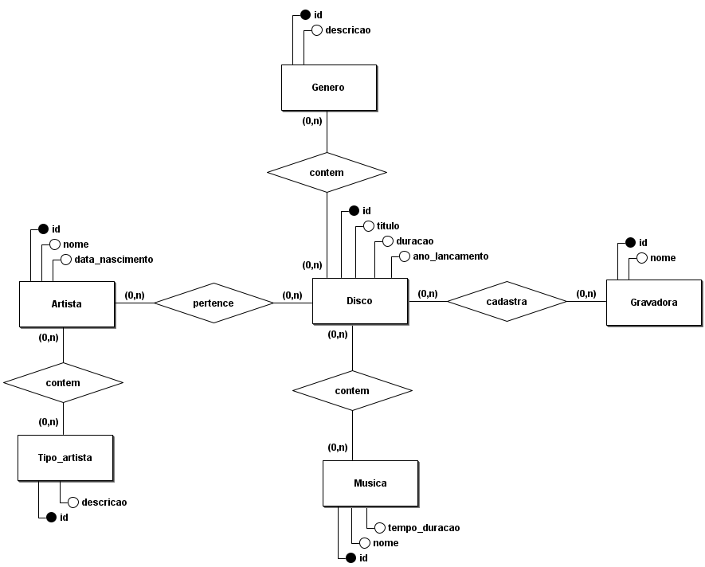
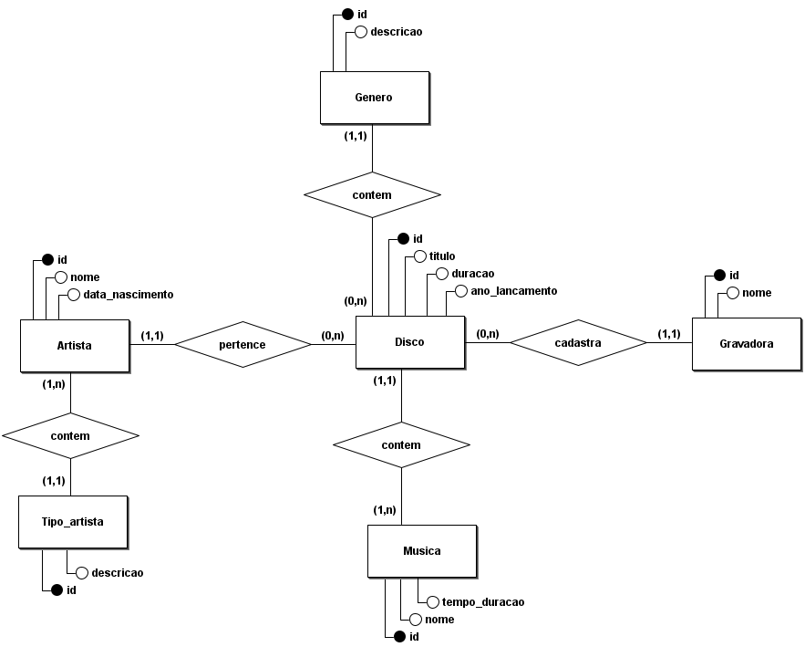
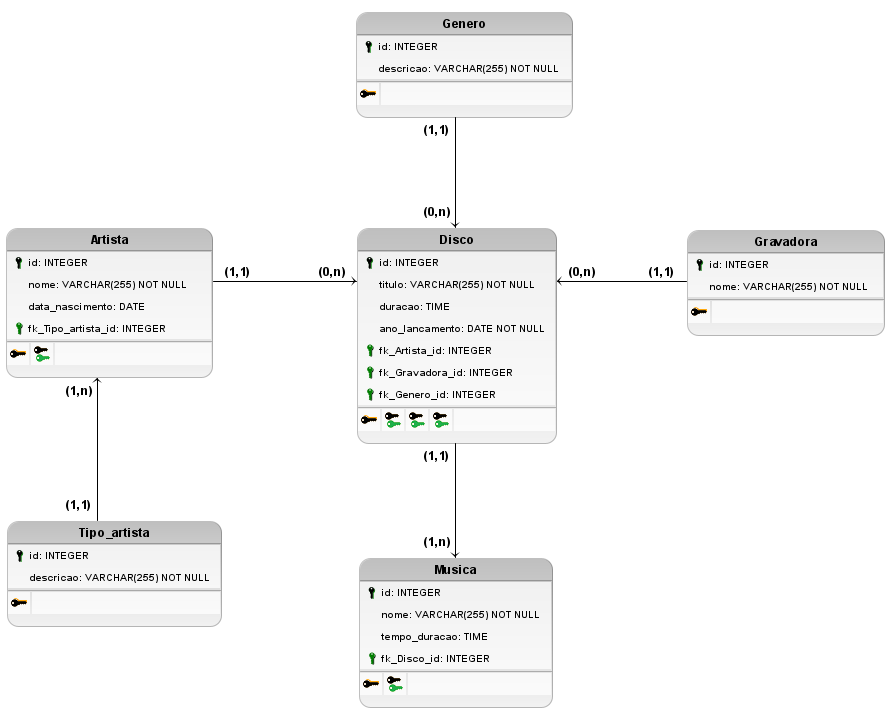

# Modelagem Discoteca 

## Regra de Negócio / Requisitos
Uma discoteca gostaria de catalogar sua coleção, e para isso contratou uma empresa pequena para criar seu sistema. Após uma longa entrevista com o analista de requisitos o mesmo chegou na seguinte regra de negocio relevante para o dono da discoteca. Todos os seus discos devem conter id, titulo, duração, ano de lançamento, o artista, e a gravadora que produziu e publicou cada disco, sendo que é relevante saber também quais são as musicas de cada disco e seu gênero musical, entenda como artista a banda, o conserto, a dupla ou o artista solo, porém para artistas solo deve-se saber além do nome a sua data de nascimento, ja para as musicas é necessário saber o nome e tempo de duração. As musicas somente podem estar em um único disco e nenhum disco deve ser cadastrado sem suas musicas, gravadoras podem ser cadastradas mesmo que não possuam discos associados a ela. Deve ser possível registrar artistas sem disco e o disco deve conter apenas um artista associado a ele.

# Modelo Conceitual (DER 1.0)

# Modelo Conceitual (DER 1.1)

Incluindo cardinalidades referente a regra de negocio com o propósito de atender os requisitos do sistema.

# Modelo Lógico (1.0)

# Modelo Lógico (1.1)

Agregação de tipos e restrições.

[Voltar](../../README.md)